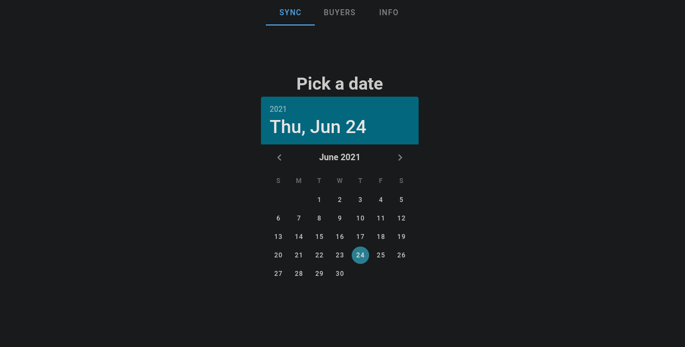
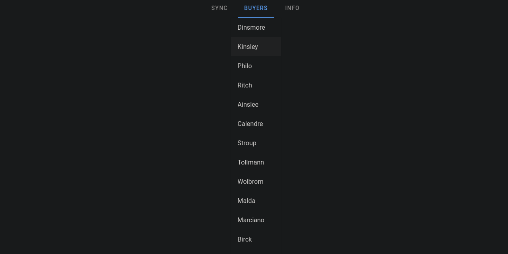
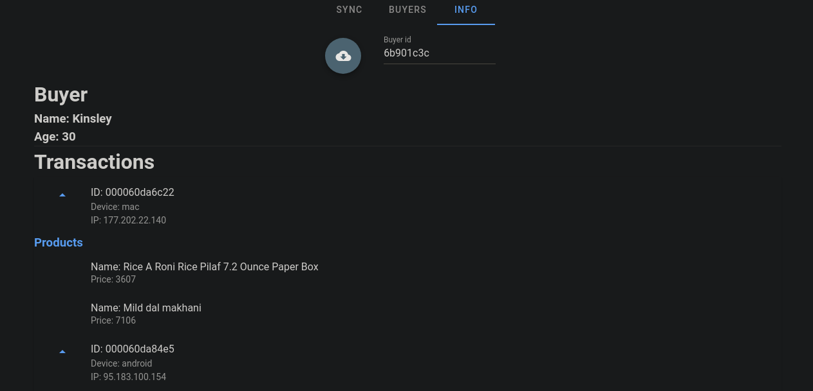

# Restaurant Service

Restaurant customers and transactions viewer.

## Core tools

### Back end

* Go v1.15.6
* [Go-chi](https://github.com/go-chi/chi) router
* [Dgraph Go client](https://github.com/dgraph-io/dgo)
* Dgraph v21.03.0

### Front end
 
* Vue 2.6.14 & Vuetify

## Interface

| | | |
|:--:|:--:|:--:|
 |  | 